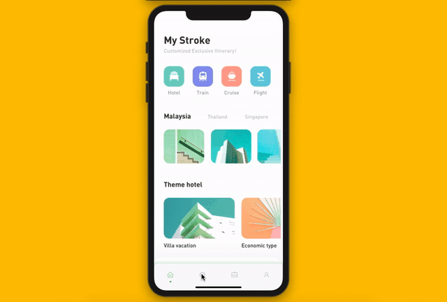
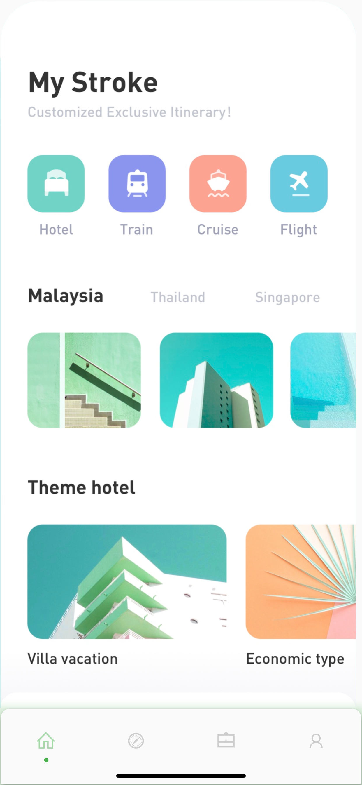

# Dot Navigation Bar
 


A bottom navigation bar that you can customize with the options you need, without any limits. You can also customize the appearance of the navigation bar with simple smooth animations, providing a nice and clean UI/UX.

 
  


## Getting Started

To install, add it to your `pubspec.yaml` file:

```
dependencies:
    dot_navigation_bar:

```

```dart
import 'package:dot_navigation_bar/dot_navigation_bar.dart';
```

## How to use it

 call `DotNavigationBar`'s constructor:

```dart
Widget build(BuildContext context) {
  return Scaffold(
    body: Center(),
    bottomNavigationBar:  DotNavigationBar(
          currentIndex: _SelectedTab.values.indexOf(_selectedTab),
          onTap: _handleIndexChanged,
          dotIndicatorColor: Colors.black,
          items: [
            
            
          ],
        ),
  );
}
```

## basic implementation

```dart
   Widget build(BuildContext context) {
    return Scaffold(
      body: Container(
        child: Image.asset("assets/IMG.png"),
      ),
      bottomNavigationBar:  DotNavigationBar(
          currentIndex: _SelectedTab.values.indexOf(_selectedTab),
          onTap: _handleIndexChanged,
          // dotIndicatorColor: Colors.black,
          items: [
            /// Home
            DotNavigationBarItem(
              icon: Icon(Icons.home),
              selectedColor: Colors.purple,
            ),

            /// Likes
            DotNavigationBarItem(
              icon: Icon(Icons.favorite_border),
              selectedColor: Colors.pink,
            ),

            /// Search
            DotNavigationBarItem(
              icon: Icon(Icons.search),
              selectedColor: Colors.orange,
            ),

            /// Profile
            DotNavigationBarItem(
              icon: Icon(Icons.person),
              selectedColor: Colors.teal,
            ),
            
          ],
        ),
    );
  }

```

The constructor has 17 attributes related to the API:

- `items`: A list of tabs to display, ie `Home`, `Profile`,`Cart`, etc
- `currentIndex`: The tab to display.
- `onTap`:Returns the index of the tab that was tapped.
- `selectedItemColor`:The color of the icon and text when the item is selected.
- `unselectedItemColor`: The color of the icon and text when the item is not selected.
- `margin`:A convenience field for the margin surrounding the entire widget.
- `itemPadding`:The padding of each item.
- `duration`: The transition duration.
- `curve`: The transition curve.
- `dotIndicatorColor`:The color of the Dot indicator.

## Contributors
@iamvivekkaushik
